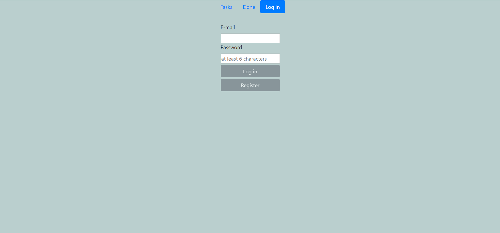
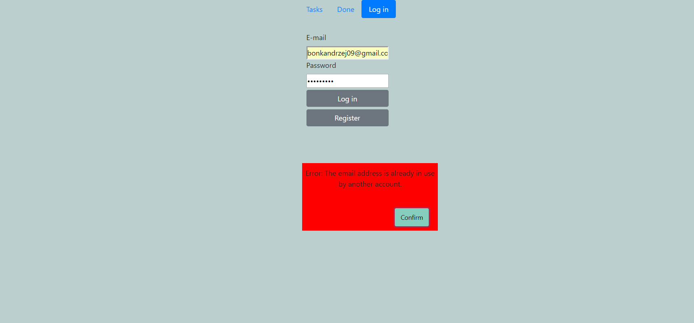
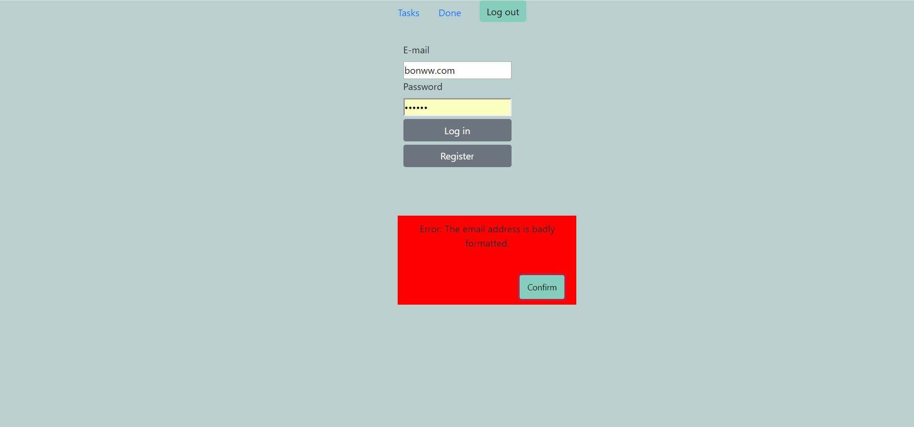
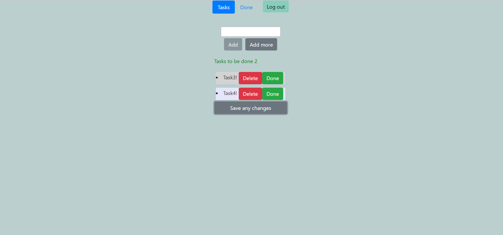
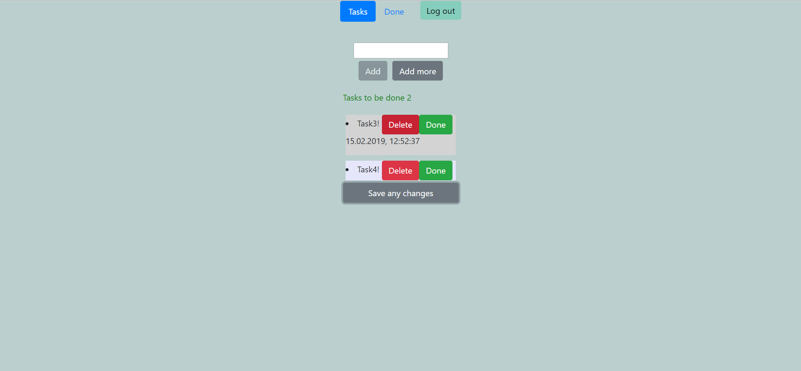
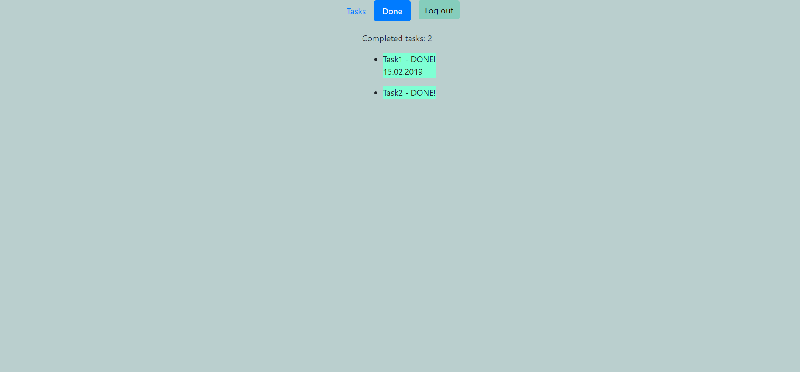
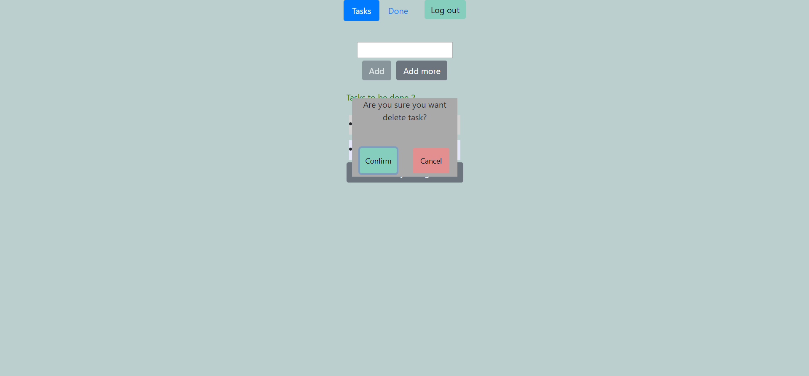

# ToDoList 
Simple application for managing our tasks.
Made to learn the basics of Angular.
Project developed using Gitflow Workflow. 

#### Stack
* Angular 7, TypeScript, HTML, Scss
* FireBase for user authentication
* MLab noSQL database to store users tasks 

#### Features
- [x] Registration new user or logging in already existing
- [x] Unregistered user can't enter to task field or done field
- [x] Notification for registration and login errors
- [x] Validation for deleting task
- [x] Adding pipes for improve readability
- [x] Showing the date when the mouse hovers over task or task already done
- [x] Add button is disabled when text field is empty

#### Examples of some features










#### Build and run Angular application (localhost:4200)

```sh
$ ng serve --open
```

